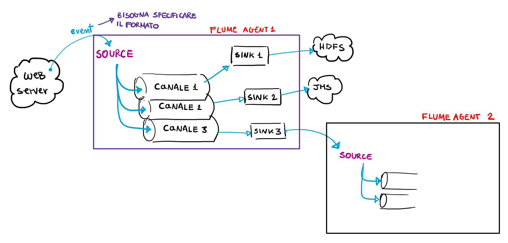

# Data Ingestion 🛄

Supponiamo di avere diverse sorgenti di dati, strutturati e non, e che in ciascuna sorgente i dati siano in un formato differente. Per **data ingestion** intendiamo il processo di spostamento di tali dati ad una destinazione. La data ingestion può essere effettuata in **batch**, ad esempio andando a raccogliere dei dati ad un certo orario, o in **realtime**, ad esempio raccogliendo continuamente dati da un sensore. 


## Differenza con ETL

**ETL** (Extract, Transform, Load) è utilizzato per sintetizzare dati per uso a lungo termine all'interno di una DWH ([Data WareHouse](https://www.bigdata4innovation.it/big-data/data-warehouse/data-warehouse-a-supporto-del-processo-di-decision-making-aziendale/)) o un [Data Lake](https://www.bigdata4innovation.it/big-data/cosae-il-data-lake-quali-vantaggi-offre-e-come-si-differenzia-dal-data-warehouse/). A differenza della data ingestion, la ETL è solitamente applicata su sorgenti pianificate per fare ciò, la cui destinazione è ben strutturata e permette di eseguire complessi task di business intelligence e reporting. 

## Hands on

...

## Flume



Per avviare un esempio di Flume dirigersi nella cartella "Flume" ed eseguire: 

```bash
docker-compose up
```

Aprire un altro terminare e connettersi con Netcat a `localhost:44444`

```bash
nc localhost 44444
```

L'input verrà inviato alla componente source dell'agent di Flume, che inserirà il messaggio nel canale e che a sua volta verrà consumato da un sink di test, chiamato logSink.


## Ce so i linkkk 📍

* [bigdata4innovation - data ingestion](https://www.bigdata4innovation.it/big-data/data-ingestion/)
* [bigdata4innovation - data lake](https://www.bigdata4innovation.it/big-data/cosae-il-data-lake-quali-vantaggi-offre-e-come-si-differenzia-dal-data-warehouse/)
* [bigdata4innovation - data warehouse](https://www.bigdata4innovation.it/big-data/data-warehouse/data-warehouse-a-supporto-del-processo-di-decision-making-aziendale/)
* [CloverDX - Difference between data ingestion and ETL](https://www.cloverdx.com/blog/what-is-the-difference-between-data-ingestion-and-etl)
* [Using docker with apache Flume](https://blog.probablyfine.co.uk/2014/05/05/using-docker-with-apache-flume-1.html)

* [Flume-hdfs docker image](https://hub.docker.com/r/avastsoftware/flume-hdfs)