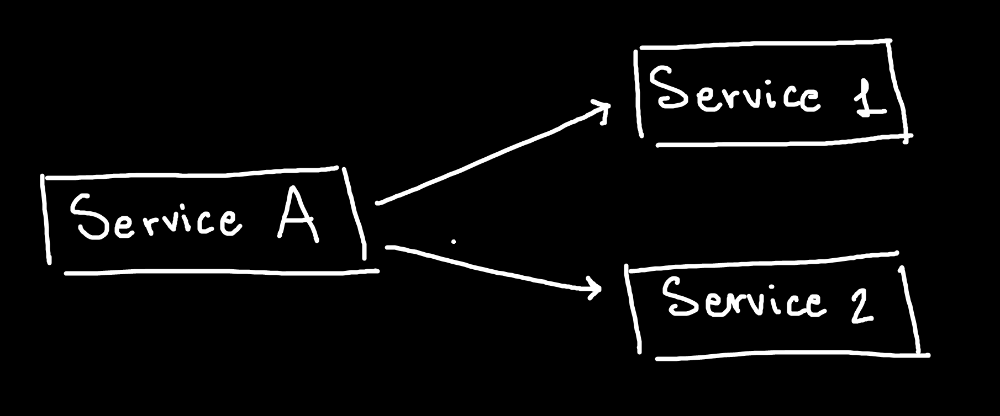

# Apache Kafka

> Kafka è una tecnologia utilizzata per integrare stream di dati tra più servizi. 


**Esempio**: Un food delivery (Service A) invia un messaggio a Service 1 e Service 2 ogni qual volta c'è un piatto da spedire. Il Service 1 invia una notifica al cliente, mentre il service 2 si occupa di calcolare le prossime raccomandazioni da fare all'utente. Se la comunicazione fosse point-to-point, allora avremmo uno schema del genere:  



Il Service A svolge la parte del **producer**, dato che produce un evento (o messaggio), mentre i Service 1 e 2 svolgono la parte dei **consumer**, poiché attendono l'evento per avviare una certa routine. Con le connessioni point-to-point, i collegamenti tra i servizi aumentano quadraticamente in funzione dei producer e consumer aggiunti: 


Analizziamo i vari problemi di questa configurazione: 

1. Ogni qual volta si introduce un nuovo attore nel sistema, bisogna collegarlo con ognuno dei servizi con cui vuole comunicare. Un produttore in questo modo deve essere a conoscenza dei consumatori che consumeranno gli eventi prodotti. 
2. Quando si inotroduce un nuovo servizio vanno aggiornati tutti gli altri servizi che devono interagire con esso. 
3. Se i consumatori sono troppo lenti rispetto ai produttori, il sistema va in crash. 

Introduciamo il concetto di message broker: 

>**Cosa è un message broker?**
>
>I servizi possono comunicare tra di loro attraverso dei messaggi. Un message broker prende i messaggi in carico e li smista ai vari servizi. Serve ad evitare che i servizi debbano implementare delle comunicazioni point-to-point con gli altri servizi, e gestisce le comunicazioni con una interfaccia comune. 

Se introducessimo Kafka come message broker allora il sistema varierebbe come segue: 


I producer inviano gli eventi / messaggi al message broker, che si occupa di mostrarli ai consumer. Un producer può anche non conoscere i consumer e continuare a svolgere il proprio lavoro. Un **topic** come un contenitore di eventi dello stesso tipo. Kafka è scalabile: è possibile utilizzarlo su un cluster di computer!

Gli eventi che vengono inviati a kafka non vengono scartati, bensì vengono conservati nel cluster Kafka! Questa feature prende il nome di **retention**, e può essere stabilita su base temporale o spaziale: 

* Spaziale: conservami al più 1 GB di eventi, poi prosegui con FIFO
* Temporale: Conservami solo gli eventi arrivati nelle ultime 24 ore 
* Mix tra le due strategie

L'architettura è **pull**, ovvero i consumatori prelevano gli eventi solo quando ne hanno bisogno, non è Kafka ad inviare gli eventi direttamente ai consumatori (grossa differenza rispetto ai tradizionali message broker). Questo è possibile proprio grazie alla retention: i dati sono disponibili su disco, quindi il consumatore può richiederli quando vuole (entro i limiti della retention). 


L'**offset** di un consumer è associato a quanti eventi ha letto nella sequenza di eventi nel topic. Nell'esempio soprastante il consumer 1 ha `offset 12`, mentre il consumer 2 ha `offset 16`. 


## Architettura

* Un nodo **broker** riceve i messaggi, li persiste su disco e li invia (su richiesta) ai consumer
* Un nodo **zookeeper** sono responsabili della sincronizzazione 

> Nelle nuove versioni di Kakfa, non è più necessario avere dei nodi zookeeper.

Perché aumentare il numero di nodi nel cluster in cui gira Kafka? Due motivi importanti: 

* Il sistema scala, gli eventi sono distribuiti tra i broker ed il tutto è più performante
* I dati persistiti vengono replicati sui broker (replication), se un broker si rompe non perdiamo i datiù

Componenti opzionali: Schema registry, Kafka connect, Kafka stream, etc.


## Topic


Possiamo creare quanti topic vogliamo all'interno di Kafka (es. uno per le ordinazioni, uno per i pagamenti). All'interno dei topic ci sono un certo numero di partizioni (partition o log), ovvero delle strutture dati in cui si scrive in maniera append only (proprio come i log) e si legge specificando un offset dall'inizio della partizione. Gli eventi all'interno delle partizioni sono coppie **(chiave, valore)**, dove la chiave non è necessariamente univoca e soprattutto può non essere specificata. I messaggi vengono inviati dai producer e non possono più essere modificati dopo essere stati inviati. La strategia di default per selezionare in quale partizione depositare il messaggio è la seguente: 

```python
partition = hash(key) % numPartition
```

Se non specifichiamo nessuna chiave, Kafka distribuisce i messaggi tramite Round-Robin in modo che esse siano bilanciate. Il programmatore può implementare una strategia custom basandosi sulla chiave.

**Ma perché esistono le partizioni?**

* Scalabilità: Kafka può inserire le partizioni in nodi diversi del cluster, quindi distribuire gli eventi tra le partizioni sarebbe equivalente a distribuire il carico di lavoro su più nodi (load balancing). 
* Permettono di sviluppare applicazioni parallele che non consumano i messaggi. 


## Acks & Retry

In base al caso d'uso è possibile impostare i broker affinché diano conferma della ricezione di un certo evento / messaggio prodotto dai producer. In un sistema affidabile, come quello bancario, si vuole una alta reliability, quindi conviene specificare `acks = all`. In contesti più rilassati, come il monitoraggio attraverso sensori IoT, è possibile rimuovere la conferma (`acks=0`) per ottenere un throughput del sistema più alto.

* `acks = 0` - il producer non chiede conferma di ricezione ai broker
* `acks = 1` - il producer necessita di un ack da parte dei broker
* `acks = all` - tutti i broker (quindi tutte le repliche) devono ricevere il messaggio 
* `retries` - numero di tentativi che il producer effettua se non riceve l'ack


## Consumer

Mentre il **producer** ha un ruolo molto semplice, le cose si complicano dal lato del consumer. Definiamo un **gruppo** di consumer come dei consumer che fanno parte della stessa applicazione, ad esempio una applicazione che utilizza lo stesso consumer istanziato più volte. Ogni consumer su kafka appartiene ad un gruppo. Riassumiamo i key concepts dell'interazione tra partizioni del topic e consumers: 

* Una partizione viene assegnata ad un solo consumer. 
* Ad un consumer possono essere assegnate più partizioni. 
* Quando si aggiunge o rimuove un consumer avviene una riassegnazione (rebalancing).
* L'offset delle partizioni è l'offset legato ad un gruppo di consumer
* Molti gruppi possono leggere dallo stesso topic (pub-sub)
* Il massimo numero di consumer all'interno di un gruppo è pari al numero di partizioni del topic che si osserva (non c'è una partizione da assegnare al consumer)

L'azione del consumer di osservare un messaggio in una partizione e confermare la sua lettura è detta **commit**. Il commit avviene automaticamente di default, ma può essere disabilitato e gestito manualmente dall'applicativo consumer. 


## Serializzazione

* Messaggi come string (es. json)
* Custom serialization (es. java serialization)
* Avro

### Avro

Avro è un sistema di serializzazione. Per utilizzarlo si deve specificare la struttura del dato da inviare con un json, ad esempio: 

```json
{
    "namespace": "io.confluent.kafka.data", 
    "type": "record", 
    "name": "Order", 
    "fields": [
        { "name": "orderId", 	"type": "string" },
        { "name": "price", 		"type": "double" },
        { "name": "qty", 		"type": "long" },
        { "name": "buyer", 		"type": "string" },
        { "name": "seller", 	"type": "string" },
    ]
}
```


## Let's code

Costruiremo un piccolo sistema in cui un producer produce 2 tipi di messaggi: 

* Messaggi contenenti un ordine dal menù
* Messaggi contenenti un pagamento

Data la diversa natura dei messaggi, andremo a creare due topic distinti sul nostro Kafka locale: `orders` e `payments`. Supponiamo di avere due consumer:

* Un consumer di delivery che mostra le consegne da effettuare
* Un consumer di statistica che calcola profitto e conteggio delle pietanze

Il file `docker-compose.yaml` contiene il setup locale di Kafka, con un broker, un nodo zookeeper, kafka-ui e un container `init-kafka` che serve a creare i topic all'avvio ([spiegazione su stack-overflow](https://stackoverflow.com/questions/64865361/docker-compose-create-kafka-topics)). Per avviare il sistema digitate: 

```bash
$ docker-compose up -d
```

I producer ed i consumer non sono inseriti nel docker-compose, dato che abbiamo già ampiamente visto come creare un container con script python all'interno. Per creare i consumer ed il producer abbiamo utilizzato la libreria ufficiale `confluent-kafka` di confluent, [qui troverete una overview](https://docs.confluent.io/clients-confluent-kafka-python/current/overview.html).


### Credits 

* [Talk di Dario Balinzo - Introduzione ad Apache Kafka](https://www.youtube.com/watch?v=Qpqdu378r0s&t=3337s)


