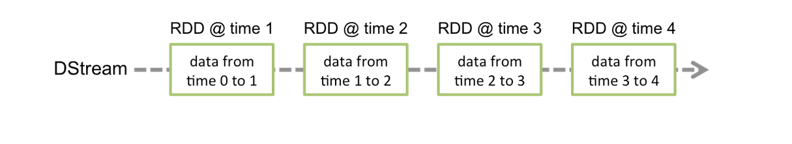
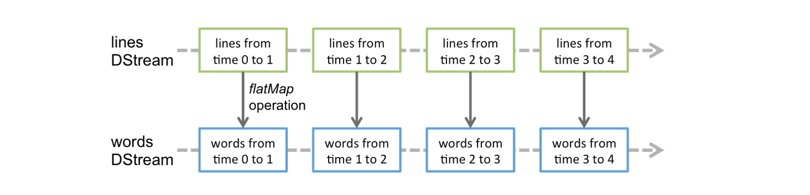

# Spark Streaming 🚀

Spark Streaming è una estensione del core Spark API che permette di processare dati in streaming, insieme ad un sacco di fantastiche proprietà garantite da spark ([vedasi Overview](https://spark.apache.org/docs/latest/streaming-programming-guide.html#overview)). Spark Streaming fornisce una astrazione di alto livello, chiamata DStream (Discretized Streaming), che rappresenta uno stream continuo di dati. 

Proviamo a descrivere molto semplicemente il funzionamento: 

1. Supponiamo di disporre di un secchio vuoto 🪣.
2. Ad ogni istante arrivano dati, che vengono depositati sul secchio 📨.
3. Ogni `t` secondi passiamo il secchio ad un nostro collega 👷.
4. Il collega svuota il secchio, processa i dati 🔨 e ci ritorna il secchio vuoto 🪣. 
5. Ripartiamo dal punto 2.  

Il secchio corrisponde al `DStream`, il nostro collega è Spark e l'intervallo `t` è chiamato batch interval. Tuttavia, dobbiamo istruire Spark su ciò che deve fare con questi dati consegnati periodicamente, andando a specificare una serie di trasformazioni e azioni da effettuare. 


## StreamingContext 

Lo `StreamingContext` è l'entry point per tutte le funzionalità di Spark Streaming. Per essere inizializzato, necessita di uno `SparkContext` ([vedasi lezione 4](https://github.com/LemuelPuglisi/TutoratoTap/tree/main/Lesson_n4#il-ruolo-del-driver)) già istanziato ed un `batchInterval`.  

```python
from pyspark import SparkContext
from pyspark.streaming import StreamingContext

sc = SparkContext(master, appName)
ssc = StreamingContext(sc, batchInterval)
```


### Un banale esempio: wordCount

```python
from pyspark.streaming import StreamingContext
from pyspark.sql import SparkSession 

if __name__ == '__main__':
    spark = SparkSession.builder.appName('network_wordcount').getOrCreate()
    ssc = StreamingContext(spark.sparkContext, 1) # APP BATCH INTERVAL = 1s
    lines = ssc.socketTextStream('0.0.0.0', 9999)
    words = lines.flatMap(lambda line: line.split(" "))
    pairs = words.map(lambda word: (word, 1))
    wordCounts = pairs.reduceByKey(lambda x, y: x + y)
    wordCounts.pprint()
    ssc.start()
    ssc.awaitTermination()
```

Per fare partire l'esempio dovete tirare su il cluster tramite il docker-compose che trovate nella cartella attraverso:

```bash
docker-compose up -d
```

Copiate lo script e avviatelo (assicurandovi di avere pySpark) e dopodiché connettetevi a `localhost:9999` con Netcat: 

```bash
nc -lk 9999
```

Inviate delle frasi e visualizzate il wordCount in streaming. 


### A grandi linee

Dopo aver inizializzato lo `StreamingContext` quello che dobbiamo fare è riassunto nella seguente lista: 

1. Definiamo una sorgente di input `DStream`
2. Definiamo le computazioni da fare periodicamente sui dati che arrivano
3. Iniziamo a ricevere dati utilizzando la funzione `streamingContext.start()`
4. Attendiamo la terminazione (manuale o per eccezioni) con `streamingContext.awaitTermination()`
5. Oppure fermiamo il programma quando vogliamo con `streamingContext.stop()`


### Da ricordare

Riguardo allo StreamingContext: 

* Una volta avviato il context, nessuna ulteriore computazione può essere aggiunta
* Una volta fermato il context, non può essere riavviato (se non da capo completamente)
* Un solo context alla volta può essere attivo in una JVM
* Lo `stop()` dello streaming context ferma anche lo spark context
  * Questo può essere evitato con il parametro `stopSparkContext=False`
* Lo SparkContext può essere utilizzato per più StreamingContext, a patto che lo streaming context precedente sia stato fermato prima che il successiva sia creato. 


## DStream

Il DStream (Discretized Stream) rappresenta uno stream continuo di dati, che siano dati provenienti da una sorgente o dati processati andando a trasformare lo streaming di input. Internamente, un DStream è composto da una serie di RDD, e ognuno di questi contiene i dati arrivati in un certo intervallo di tempo. 



Ogni funzione applicata ad un DStream si traduce in operazioni applicate ad ognuno degli RDD sottostanti. Nell'immagine sottostante troviamo un esempio in cui andiamo ad effettuare una `flatMap` in cui dividiamo delle frasi in input in parole: 




