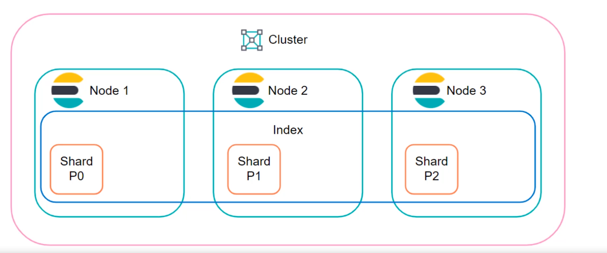
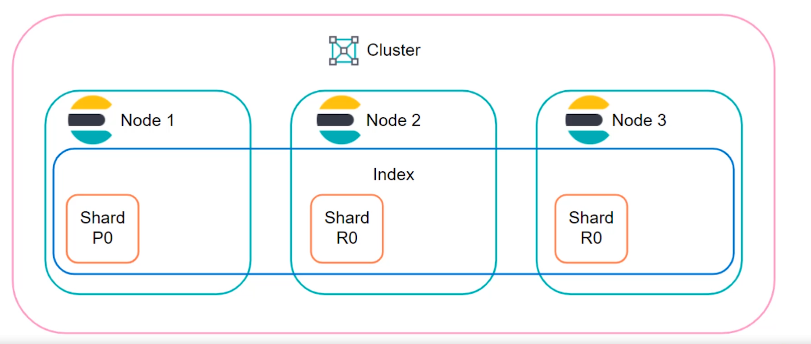
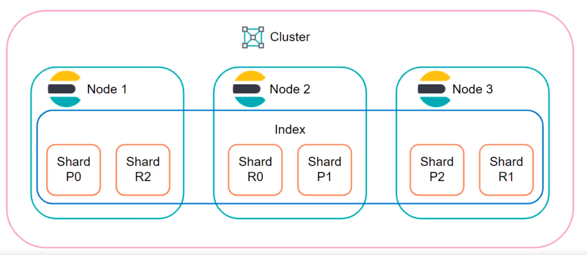

# Elasticsearch & Kibana 🔎

Elasticsearch è un motore di ricerca e di analisi distribuito per tutti i tipi di dato (testuale, numerico, geospaziale, strutturato e non). Perché utilizzarlo?

* Scalabile
* Real-time
* Sicuro
* Developer-friendly
* Storage versastile
* Permette query e aggregazione

## Elastic Stack (ELK)

Lo stack ELK (Elasticsearch, Logstash, Kibana) è uno stack utilizzato per eseguire le seguenti azioni: 

1. Logstash: collezione di dati, connessione di sistemi
2. Elasticsearch: Archiviazione, ricerca e analisi di dati
3. Kibana: Esplorazione e visualizzazione dei dati

Casi d'uso più comuni: 

* Enterprise Search (ricerca di documenti e dati interni all'azienda)
* Observability (esplorazione di grandi basi di dati)
* Security (analisi di logs, rilevazione di anomalie)

## Terminologia

| Termine  | Descrizione                                                  |
| -------- | ------------------------------------------------------------ |
| Node     | Singola istanza di Elasticsearch                             |
| Cluster  | Una collezione di nodi che lavorano insieme                  |
| Index    | Un contenitore di documenti, contiene shards                 |
| Shard    | Unità di lavoro, ciò su cui scriviamo e leggiamo             |
| Document | Struttura dati (json) su cui archiviare informazione, risiede su un index |

I contenitori principali sono gli `index`, che al loro interno contengono `shard`, ovvero le unità di lavoro che consumano le risorse. Vi sono due tipi di `shard`, le `primary shard` che contengono i dati, e i `replica shard` che replicano i dati (fault tolerance). Ovviamente, primary e replica risiedono all'interno di diversi nodi del cluster, cosicché quando un nodo è down, il dato è comunque disponibile all'interno di una replica residente in un altro nodo. 


## Write & Read Scalability

La *write scalability* consiste nel distribuire il carico di lavoro causato da delle azioni di write all'interno di un indice. Nell'immagine sottostante, supponiamo di avere un cluster con 3 nodi. Quando creiamo un indice, supponiamo che 3 primary shard relative a questo indice siano create, una per ogni nodo. Quando vogliamo inserire dati su questo indice, possiamo inserirli indifferentemente su qualunque dei 3 shard. Questo vuol dire che il nostro lavoro di scrittura è **distribuito** tra i 3 nodi $\to$ Write Scalability! 🎉



I dati vengono inoltre replicati tra i nodi, vediamo nell'immagine sottostante che il nodo 1 contiene la shard primaria `P0`, mentre i nodi 2 e 3 contengono repliche `R0`. Oltre ad uno scopo di fault tolerance, le repliche permettono di leggere il dato da uno qualsiasi dei nodi che lo contiene $\to$ Read scalability!  🎉



Sotto troviamo un'immagine che riassume entrambi i concetti, assicurandoci che le repliche degli shard non stiano insieme alle rispettive primary shard (altrimenti la replica non avrebbe senso). 




## Installazione

La cartella `elasticsearch` contiene tutto ciò che serve ad eseguire il setup del sistema, compreso Kibana, di cui parleremo meglio nella prossima lezione. Il docker-compose contiene delle istruzioni per la creazione dei dovuti certificati, necessari a partire da `elasticsearch v8` che è secure-by-default.

All'interno della cartella è riposto anche un file `.env` con alcune delle configurazioni impostate, come le password degli utenti di ES e Kibana, o le porte che verranno mappate. Modificatele se necessario!

Per far partire il cluster eseguite il comando: 

```
docker-compose up -d
```

Per distruggere il cluster insieme ai volumi creati, eseguire:

```
docker-compose down -v
```

Per passare dei settings specifici attraverso file YAML potete attaccare la vostra configurazione ai rispettivi container: 

(Elasticsearch conf aggiunte al servizio `es01`)
```
    volumes:
      - ./es01.yml:/usr/share/elasticsearch/config/elasticsearch.yml
      - ...
```

(Kibana conf aggiunte al servizio `kibana`)
```
    volumes:
      - ./kibana.yml:/usr/share/kibana/config/kibana.yml
      - ...
```

Per maggiori informazioni, consultate la [documentazione ufficiale](https://www.elastic.co/guide/en/elastic-stack-get-started/current/get-started-stack-docker.html).

Dopo l'installazione, il container contenente nodi ES conterrà le seguenti cartelle relative ad ES: 

| Type    | Description                                                  | Default Location                           | Setting        |
| ------- | ------------------------------------------------------------ | ------------------------------------------ | -------------- |
| home    | ES home dir or `$ES_HOME`                                    | Directory created by unpacking the archive |                |
| bin     | Binary scripts including `elasticsearch` to start a node and `elasticsearch-plugin` to install plugins | `$ES_HOME/bin`                             |                |
| conf    | Configuration files including `elasticsearch.yml`            | `$ES_HOME/config`                          | `ES_PATH_CONF` |
| data    | The location of the data files of each index / shard allocated on the node. | `$ES_HOME/data`                            | `path.data`    |
| logs    | Log files location                                           | `$ES_HOME/logs`                            | `path.logs`    |
| plugins | Plugin files location. Each plugin will be contained in a subdirectory. | `$ES_HOME/plugins`                         |                |
| repo    | Shared file system repository locations. Can hold multiple locations. A file system repository can be placed in to any subdirectory of any directory specified here. | Not configured                             | `path.repo`    |

## Possibili errori 

```
Elasticsearch: Max virtual memory areas vm.max_map_count [65530] is too low, increase to at least [262144]
```

* [Link alla soluzione](https://stackoverflow.com/questions/51445846/elasticsearch-max-virtual-memory-areas-vm-max-map-count-65530-is-too-low-inc). 

## Hands on

Informazione utile: 

|     servizio    | porta |
| --------------- | ----- |
|  Elasticsearch  | 9092  |
|  Kibana         | 5601  |

Una volta inizializzati i servizi, accedete a Kibana attraverso un browser, all'indirizzo `localhost:5601`. 

Loggate attraverso le seguenti credenziali: 
```
Username: elastic
Password: tutoratotap
```
E iniziate ad usare Elasticsearch e Kibana! 
Scaricate i dati di esempio per studiare come effettuare delle query su Elasticsearch (cliccare su `try our sample data`). 


## Query utili

Controllo dello stato del cluster Elasticsearch:
```
GET _cluster/health?pretty
```

Inserimento documento in index `inspections`:

```
POST /inspections/_doc
{
  "business": "ristorante Taiyo", 
  "business_city": "Catania", 
  "business_location": {
    "type": "Point", 
    "coordinates": [
        37.52110709633756, 
        15.111991598187021
      ]
  },
  "business_latitude": "37.52110709633756", 
  "business_longitude": "15.111991598187021", 
  "inspection_date": "2022-02-04T00:00:00.000", 
  "risk_category": "Low Risk", 
  "violation_description": "Tutto ok."
}
```

Possiamo visualizzare anche attraverso chiamate API dirette ad ES, ad esempio: 

```
https://localhost:9200/inspections/_search
```

Questo richiederà sia l'`https` che l'autenticazione (`basic-auth`). La stessa query la possiamo fare attraverso la GUI di Kibana: 

```
GET /inspections/_search
```

### Query tutorial

```json
# Inserimento sull'indice e implicita creazione di quest'ultimo

POST /inspections/_doc
{
  "business": "ristorante Taiyo", 
  "business_city": "Catania", 
  "business_location": {
    "type": "Point", 
    "coordinates": [
        37.52110709633756, 
        15.111991598187021
      ]
  },
  "business_latitude": "37.52110709633756", 
  "business_longitude": "15.111991598187021", 
  "inspection_date": "2022-02-04T00:00:00.000", 
  "risk_category": "Low Risk", 
  "violation_description": "Tutto ok."
}

# Query di ricerca sull'index

GET /inspections/_search

# Query al documento specifico attraverso il suo ID.

GET /inspections/_doc/eIF6CoEBap3EwULga4Kp

# Eliminazione di un topic

DELETE /inspections

# Creazione esplicita dell'index con dei settings. 

PUT /inspections
{
  "settings": {
    "index.number_of_shards": 1, 
    "index.number_of_replicas": 0
  }
}

# Inserimento bulk di dati (più dati per volta)
# Il json inviato prima del dato serve ad impostare il suo ID
# attenzione: ridurre il json contenente i dati ad una sola riga! 
# tool che fa questo: https://w3percentagecalculator.com/json-to-one-line-converter/

POST /inspections/_bulk
{ "index" : { "_id" : "1" } }
{"business":"ristorante Taiyo","business_city":"Catania","business_location":{"type":"Point","coordinates":[37.52110709633756,15.111991598187021]},"business_latitude":"37.52110709633756","business_longitude":"15.111991598187021","inspection_date":"2022-02-04T00:00:00.000","risk_category":"Low Risk","violation_description":"Tutto ok."}
{ "index" : { "_id" : "2" } }
{"business":"Mensa Cittadella","business_city":"Catania","business_location":{"type":"Point","coordinates":[37.52436046965566,15.07101682670012]},"business_latitude":"37.52436046965566","business_longitude":"15.07101682670012","inspection_date":"2022-02-04T00:00:00.000","risk_category":"High Risk","violation_description":"Trovati piccioni nella cucina (vivi e morti)."}

# Query: troviamo tutte le mense, quindi i ristoranti che hanno "mensa" nel nome.
GET /inspections/_search
{
  "query": {
    "match": {
      "business": "mensa"
    }
  }
}

# Il max-score è un indice di rilevanza del risultato per la query. 
# I risultati sono ordinati per max-score. 

# Cerchiamo adesso i ristoranti ad alto rischio igienico-sanitario
# Dato che dobbiamo cercare attraverso una stringa contenente due parole, utilizziamo
# match_phrase anziché match

GET /inspections/_search
{
  "query": {
    "match_phrase": {
      "risk_category": "High Risk"
    }
  }
}


```

