# Kibana 101

Kibana è una UI utilizzata per visualizzare ed analizzare i dati di Elasticsearch. Il setup di Kibana ed Elasticsearch con docker-compose è spiegato nella [lezione 7](https://github.com/LemuelPuglisi/TutoratoTap/tree/main/Lesson_n7). Dopo aver eseguito il docker-compose, aspettate qualche minuti affinché Kibana sia totalmente inizializzato, dopodiché redirigetevi all'indirizzo `localhost:5601`. Le credenziali in questo esempio sono le seguenti:

```
👤 username: elastic
🔒 password: tutoratotap
```

 

## Caricare dati di esempio

Dopo aver eseguito l'accesso con le credenziali sarete rediretti nella home. Scendete fino alla seguente schermata: 

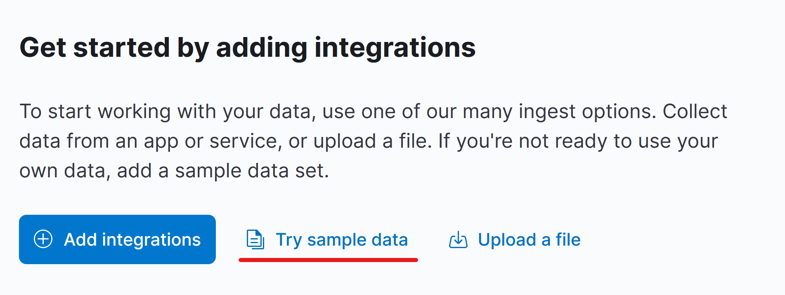

E caricate tutti i dati di esempio disponibili. I 3 samples (eCommerce, Flights, Logs) vengono caricati sui seguenti 3 indici di ES:

```
kibana_sample_data_ecommerce 	4.2mb
kibana_sample_data_logs      	8.9mb
kibana_sample_data_flights		6.0mb
```


## Data view

Supponiamo di inviare ad ES dei dati di log ogni giorno, e dividerli in indici che seguono il seguente pattern `website-logs-<data-di-oggi>`. Il risultato finale prende il nome di *time series*. Se vogliamo analizzare i dati relativi ad una serie temporale, o in generale vogliamo aggregare più indici, abbiamo bisogno delle **data view** (prima chiamati index-pattern). Per creare una data view cliccate sul burger menu sulla sinistra e scendete fino alla sezione `Stack Management > Kibana > Data Views`. Cliccate nella sezione e premete `Create data view` in alto a destra. 

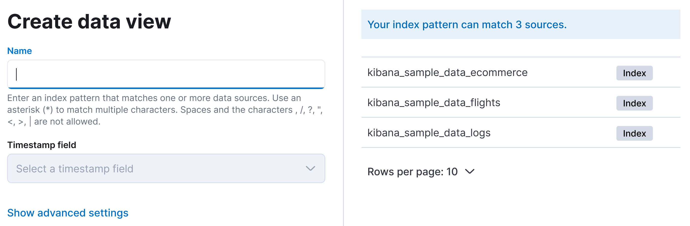

Indicate l'indice o il pattern da analizzare, nel caso della precedente serie temporale potremmo inserire `website-logs-*`, dove la `*` permette di matchare i log di tutti i giorni inseriti. La data view richiede un timestamp per distinguere i dati nell'ordine di arrivo.

> Nell'esempio ho cancellato la data view esistente `kibana_sample_data_ecommerce` e l'ho ricreata. 
> Dopodiché su `Stack Management > Saved Object` ho cancellato tutte le visualizzazioni e la dashboard dell'indice, così da poterli creare da zero. 


## Concetti essenziali da comprendere

* KQL (Kibana Query Language) - [video tutorial](https://www.youtube.com/watch?v=wfqItAlUy8g)
* Text vs Keyword - [Blog article](https://www.elastic.co/blog/strings-are-dead-long-live-strings)


## Dashboard e Visualizzazioni

> Utilizzeremo la Data View appena creata: `kibana_sample_data_ecommerce`.

Clicchiamo nel menù a sinistra e dirigiamoci su `Analytics > Dashboard`, dopodiché clicchiamo su `Create dashboard`, e poi su `Create visualization`. 


### Pie chart

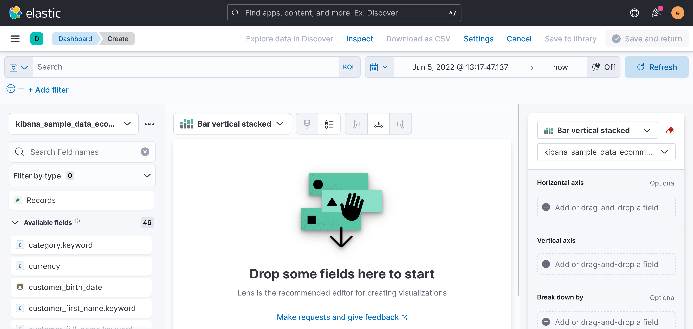

Proviamo a creare un piechart (diagramma a torta) delle categorie degli item acquistati, per comprendere quali sono le categorie prevalenti e quelle meno frequenti.  

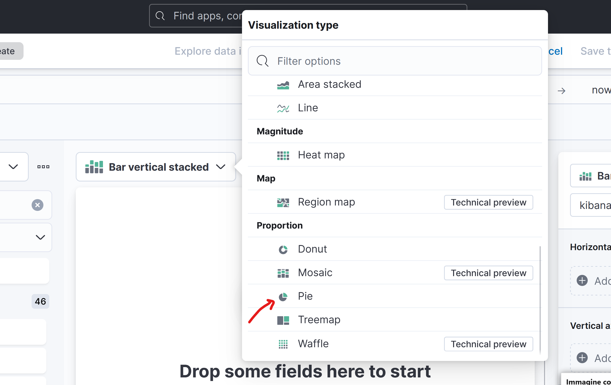

Dal menù a sinistra selezioniamo l'attributo `category.keyword` e attraverso drag & drop trasciniamolo al centro della schermata. 

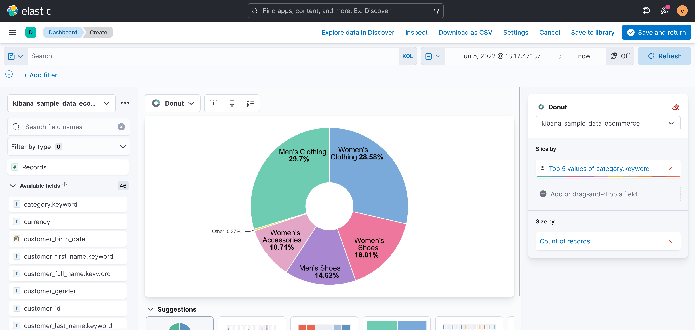

Salviamo il grafico attraverso il pulsante in alto a destra. Il grafico sarà mostrato nella Dashboard. Se non lo abbiamo già fatto, salviamo la Dashboard e diamogli un nome. 

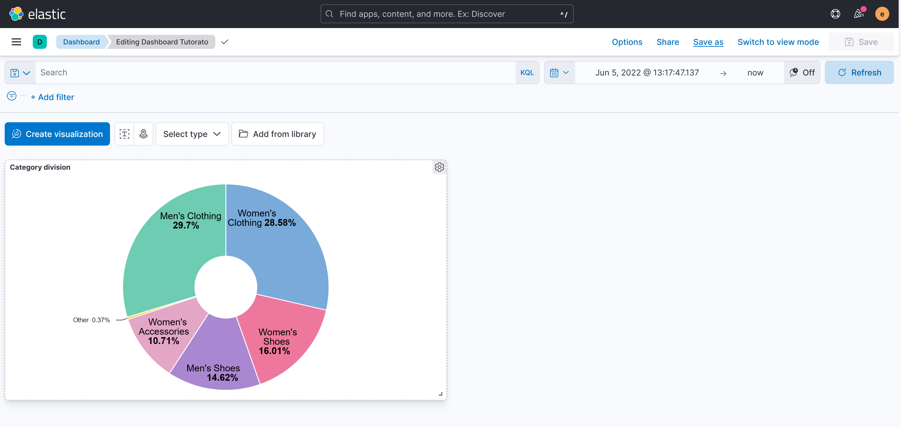


### Vertical Bar

Supponiamo di voler analizzare la media dei prezzi di acquisto per paese (indicato con ISO-code). Creiamo un'altra visualizzazione e clicchiamo sul tipo di grafico `Vertical Bar`. Sulla destra abbiamo varie configurazioni. Vogliamo posizionare nell'asse x i paesi: 

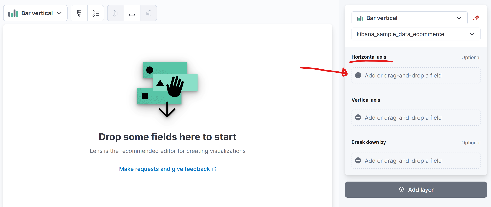

Come Fields specificheremo `geoip.country_iso_code`, un campo del documento che contiene il codice standard del paese da cui proviene (es. IT - italy). Specifichiamo su `Number of values` quanti paesi vogliamo analizzare (es. top 10 paesi che spendono di più). Specifichiamo l'ordine tra ascending o descending, in questo caso vogliamo che siano ordinato in maniera decrescente. 

Torniamo indietro e clicchiamo su Vertical Axis, che ci farà scegliere un tipo di funzione rapida (ma possiamo anche specificare una formula). Selezioniamo la media (average) e andiamo avanti. Scegliamo il campo (Field)  `taxful_total_price`. Il risultato finale sarà il seguente: 

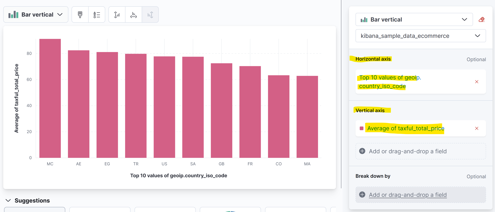


### Maps

> Credits: [Kibana official documentation](https://www.elastic.co/guide/en/kibana/current/maps.html).

Se i nostri dati contengono delle coordinate, possiamo disporli su una mappa. Dirigiamoci nella Dashboard e creiamo una nuova mappa: 

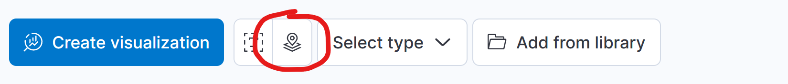 

Per disporre i documenti all'interno di una mappa, ogni documento deve disporre di un attributo di localizzazione, di tipo `geo_point`, contenente le coordinate del punto.  E' possibile aggiungere alla mappa vari tipi di *layer di visualizzazione*: 

* Documents: principalmente visualizza i singoli documenti nella mappa
* Choropleth: confronta statistiche su territori divisi dai confini (es. risultati elettorali)
* Clusters: crea dei cluster di documenti geolocalizzati
* Heat map: mappa di calore che evidenzia la concentrazione di documenti nelle aree

E molti altri. Ad esempio selezioniamo il layer `Cluster` ed indichiamo l'attributo che localizza i documenti.  Otterremo qualcosa del genere: 

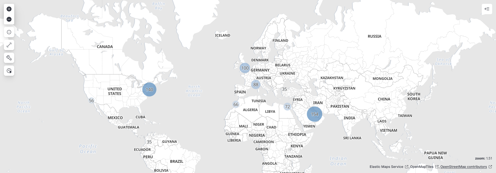

Salviamo la mappa ed aggiungiamola alla dashboard. 


## Import/Export della Dashboard

Una volta costruita la Dashboard, è possibile salvarla insieme a tutti gli oggetti inseriti (visualizzazioni e mappe) in un file di tipo `ndjson`. Per fare ciò, cliccate sul menù a sinistra e dirigetevi su `Management > Stack Management`, nella tendina a sinistra cliccate su `Kibana > Saved Objects` cercate la vostra Dashboard ed esportatela, assicurandovi di includere gli oggetti al suo interno.  

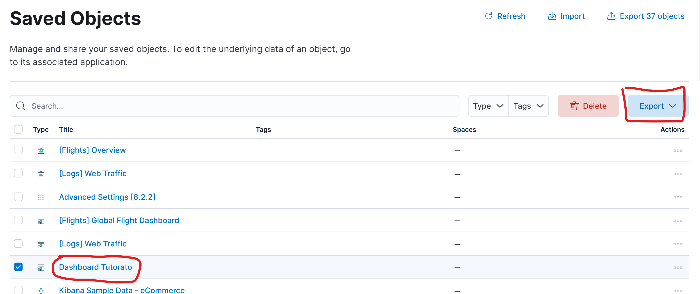

Quando tirate sù una nuova istanza di Kibana, dovrete stare attenti a ricreare la Data View allo stesso modo, così che la Dashboard che avete salvato possa operare con lo stesso tipo di dati. Per ricaricare la Dashboard salvata rientrate nella sezione `Saved Objects` e cliccate su `import` 

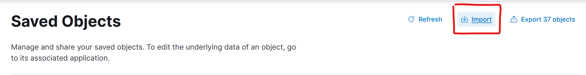 


### Import dashboard tramite API

Per chi volesse cimentarsi, esiste la [Import Objects API](https://www.elastic.co/guide/en/kibana/current/saved-objects-api-import.html) per importare degli oggetti in formato `ndjson` su Kibana. Attraverso questa API è possibile caricare la Dashboard. E' possibile creare uno script in bash che carichi automaticamente la Dashboard comunicando con il container di Kibana. Questo script potrebbe addirittura essere containerizzato e inserito nel docker-compose, in modo che si avvii dopo Kibana e importi la Dashboard automaticamente. 


